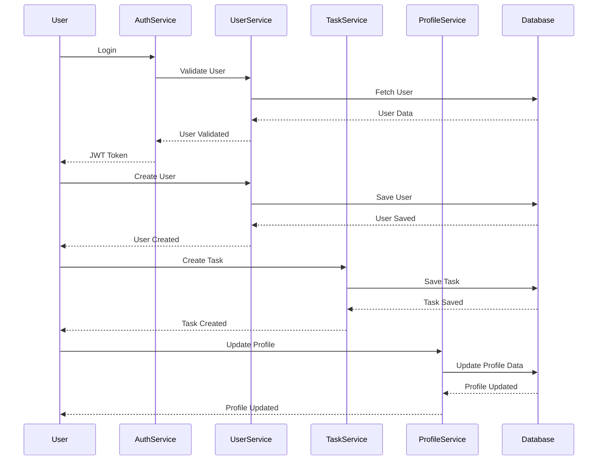

# Mini Task

Welcome to Mini Task. This repository contains the backend, frontend, and mobile services for Mini Task. Below is the detailed documentation for setting up and running the project.

## Table of Contents

1. [Overview](#overview)
2. [Getting Started](#getting-started)
3. [Running the Project](#running-the-project)
4. [Services](#services)
   - [Backend](#backend)
   - [Frontend](#frontend)
   - [Mobile](#mobile)
5. [CI/CD](#cicd)
6. [Postman Collection](#postman-collection)
7. [Design Architecture](#design-architecture)

## Overview

Mini Task is a full-stack application that includes backend, frontend, and mobile services. The backend is built using NestJS, the frontend using React, and the mobile app using Flutter. This project also includes CI/CD pipelines for automated testing and deployment.

## Getting Started

### Prerequisites

- Node.js
- Yarn or npm
- Docker (for running the database and other services)

### Installation

#### Clone the repository:

```bash
git clone https://github.com/sulthonzh/minitask.git
cd project-name
```

#### Install dependencies for backend and frontend:
```bash
cd backend
yarn install
# or
npm install

cd ../frontend
yarn install
# or
npm install
```

### Set up environment variables:

Create a .env file in the root directory and add the following:

```env
DATABASE_HOST=localhost
DATABASE_PORT=5432
DATABASE_USER=yourusername
DATABASE_PASSWORD=yourpassword
DATABASE_NAME=yourdatabase
JWT_SECRET=yourjwtsecret
```

### Running the Project

### Docker Setup

Ensure Docker is installed and running on your machine. The project includes a docker-compose.yml file to set up the PostgreSQL database and other services.

#### Start the services using Docker:

```bash
docker-compose up -d
```

### Running the Backend

#### Start the backend application:

```bash
cd backend
yarn start:dev
# or
npm run start:dev
```

### Running the Frontend

#### Start the frontend application:

```bash
cd frontend
yarn start
# or
npm start
```

### Running the Mobile App

For mobile setup, refer to the README.md in the mobile directory.

### Services

#### Backend

For detailed documentation on the backend service, including endpoints and DTOs, refer to the Backend README.

#### Frontend

For detailed documentation on the frontend service, refer to the Frontend README.

#### Mobile

For detailed documentation on the mobile service, refer to the README.md in the mobile directory.

## CI/CD

The ci-cd directory contains the CI/CD pipelines for automated testing and deployment. Ensure you have the necessary permissions and configurations to use the CI/CD pipelines.

## Postman Collection

The postman directory contains the Postman collection for testing the API endpoints. Import the collection into Postman to get started with API testing.

## Design Architecture

### High-Level Design



### Detailed Design

- `User Service`: Handles user-related operations such as CRUD.
- `Task Service`: Manages tasks including creating, updating, and deleting tasks.
- `Profile Service`: Manages user profiles including viewing, updating, and deleting profiles.
- `Auth Service`: Handles authentication processes including login, registration, and token management.